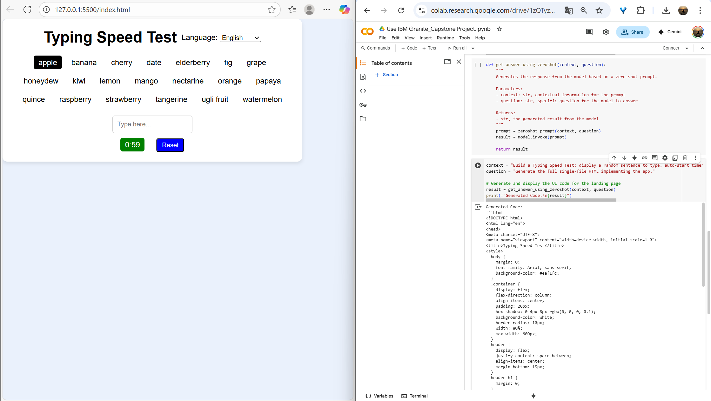
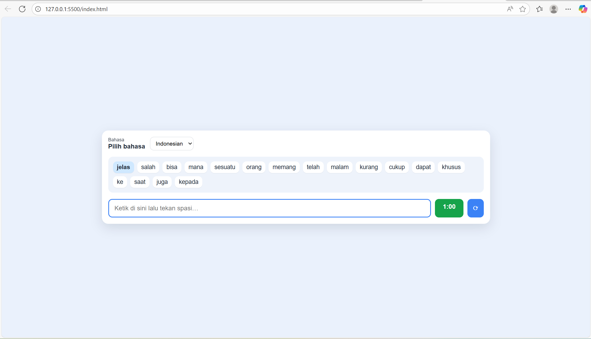

# Typing Speed Test
https://lets-type1.netlify.app/

# Description
Typing Speed Test is a web-based application for measuring typing speed (WPM — Words Per Minute) and user accuracy.
There are two language options: Indonesian or English. Users type predetermined words for one minute.
After the time is up, the results are displayed, including WPM, accuracy, number of correct words, and number of incorrect words.

# Technologies Used
- Use IBM Granite (model="ibm-granite/granite-3.3-8b-instruct") to generate first code before develop
- Basic logic or UI interaction
- HTML
- CSS
- Uses vanilla JavaScript

# Features
- Feel better open the web using a laptop/pc
- Have two language options: Indonesian and English
- Automatic calculation

# Setup Instruction
1. Clone this repository
   https://github.com/BelaLisfatia/IBM-SkillsBuild-X-Hacktiv8.git
2. Go to the project folder
3. Open index.html file through the VS Code live server
4. Start type

# AI support explanation
AI IBM Granite (model="ibm-granite/granite-3.3-8b-instruct")
- Granite, as an AI assistant, is tasked with writing automated programs.
- With a zero-shot prompting approach, users do not need to provide code examples—just a description of the features and UI.
- LangChain + Replicate → used as a wrapper to communicate with Granite.
- Result: AI automatically generates the HTML+CSS+JS for a complete Typing Speed Test application, according to specifications.
  

Develop code use OpenAI ChatGPT
- Improving the initial structure of HTML, CSS, and JavaScript
- Optimizing functions such as timers, result calculations, and responsive displays

